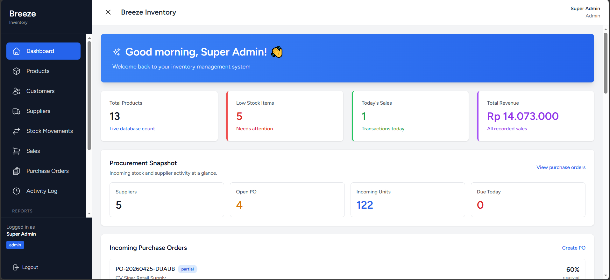
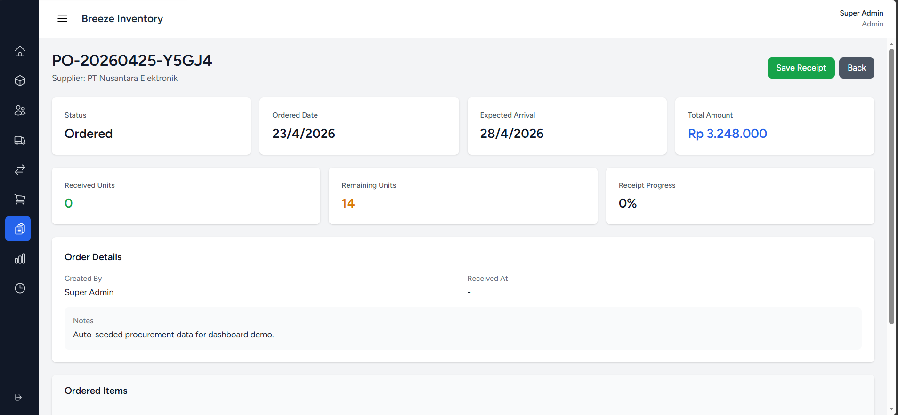
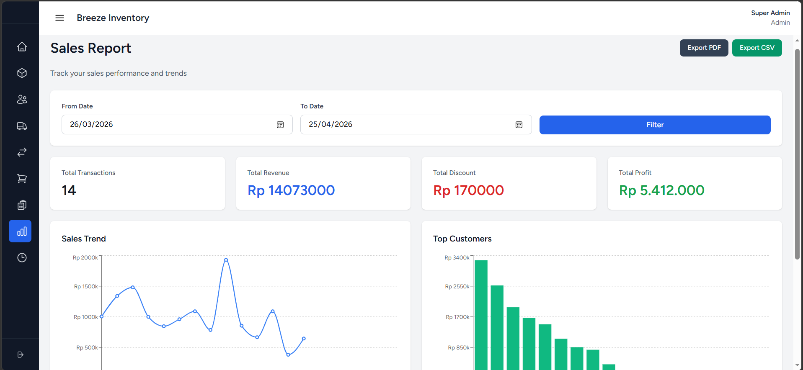
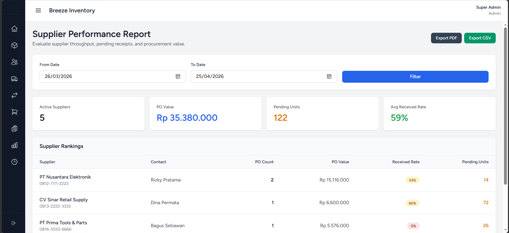
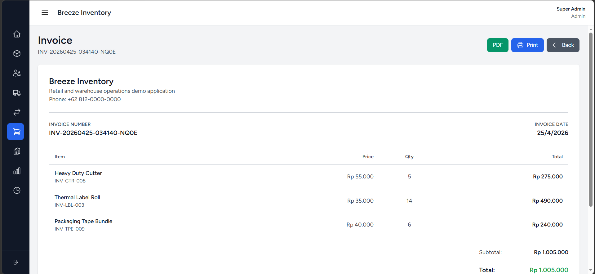
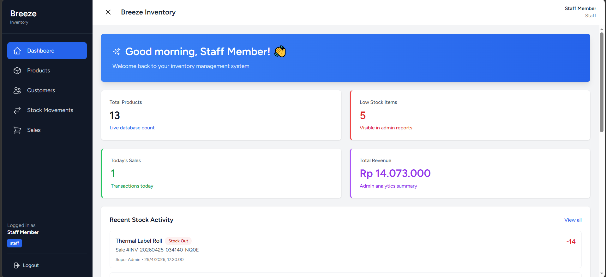

# Breeze Inventory

Breeze Inventory is a portfolio-grade fullstack business application built with Laravel 12, React, Inertia, and Tailwind CSS. The app models the daily workflows of a small retail or warehouse operation: product management, stock control, sales processing, procurement, reporting, and audit visibility.

## Project Goal

This repository was built to showcase practical fullstack engineering, not just CRUD screens. The focus is on:

- transactional business logic for stock-sensitive workflows
- Laravel service layer, policies, form requests, and feature tests
- React + Inertia interfaces that feel like a cohesive business product
- realistic reporting, procurement, and inventory scenarios for live demos

## Portfolio Highlights

- Outbound inventory flow through sales transactions with automatic stock deduction
- Inbound inventory flow through supplier purchase orders and partial receiving
- Role-based access control aligned in backend authorization and frontend navigation
- CSV export for operational reports
- Activity log for critical operational events
- Seeded demo dataset so dashboard and reports are populated immediately

## Feature Matrix

| Module | Key Capabilities | Portfolio Value |
| --- | --- | --- |
| Dashboard | KPI cards, recent stock movements, procurement snapshot, top suppliers | Shows product thinking and aggregated backend queries |
| Products | SKU, cost, price, stock alert, low-stock awareness | Demonstrates inventory domain modeling |
| Stock Movements | Stock in, stock out, adjustment, stock guard rails | Highlights transactional consistency |
| Sales | Multi-item sale form, invoice, stock deduction, cashier attribution | Demonstrates POS-style workflow |
| Customers | Customer directory and repeat buyer support | Adds operational context beyond product CRUD |
| Suppliers | Supplier management and procurement data | Expands the system into upstream inventory flow |
| Purchase Orders | Multi-line PO creation, partial receiving, progress tracking | Strong fullstack business workflow showcase |
| Reports | Sales, low stock, product performance, supplier performance, CSV export | Demonstrates analytics and reporting UX |
| Activity Logs | Recorded critical actions and operational traceability | Adds production-minded audit capability |

## Technical Stack

- Backend: Laravel 12, PHP 8.3, MySQL
- Frontend: React 18, Inertia.js, Tailwind CSS
- Data Visualization: Recharts
- Build Tooling: Vite
- Notifications: Sonner
- Testing: Pest / PHPUnit

## Architecture Notes

The application uses a service-oriented domain layer so controllers stay focused on orchestration:

- `InventoryServices` handles stock increases, decreases, and guarded adjustments
- `SalesService` creates transactional sales records and deducts stock
- `PurchaseOrderService` creates supplier orders and processes partial/full receiving
- `ActivityLogService` centralizes audit-style event recording

Supporting patterns used across the codebase:

- Form Requests for validation
- Policies and Gates for authorization
- Transaction boundaries for stock-sensitive writes
- Inertia pages for server-driven SPA navigation
- Feature tests for authorization and domain behavior

## Seeded Demo Data

`php artisan migrate --seed` now creates a realistic demo workspace:

- 2 users with different roles
- curated product catalog with stock history
- suppliers and customers with business-friendly sample data
- purchase orders in `ordered`, `partial`, and `received` states
- sales transactions spread across recent dates
- low-stock items, stock adjustments, and audit log entries

This means the dashboard, charts, procurement cards, activity log, and reports are ready to demo right away.

## Demo Accounts

- Admin
  - Email: `admin@gmail.com`
  - Password: `password123`
- Staff
  - Email: `staff@gmail.com`
  - Password: `password123`

## Suggested Demo Flow

If you want to present this project in 3-5 minutes, this sequence works well:

1. Login as `admin` and open the dashboard to show inventory and procurement KPIs.
2. Open `Purchase Orders` to demonstrate partial receiving and stock progress.
3. Open `Reports` to show sales analytics, low-stock insights, supplier performance, and CSV export.
4. Open `Activity Logs` to show operational traceability.
5. Login as `staff` to show that admin-only modules disappear and protected routes stay restricted.

For a ready-to-use interview script and talking points, see [docs/portfolio-demo-guide.md](docs/portfolio-demo-guide.md).

## Local Setup

```bash
composer install
npm install
cp .env.example .env
php artisan key:generate
php artisan migrate --seed
npm run dev
php artisan serve
```

If you want a production asset build:

```bash
npm run build
```

## Testing

Run the automated test suite with:

```bash
php artisan test
```

The suite covers:

- authentication and profile flows
- authorization for admin-only modules and report access
- sales stock deduction behavior
- purchase-order creation and partial receiving
- dashboard procurement metrics
- CSV report export
- activity log visibility
- supplier performance reporting

## What This Project Demonstrates

This codebase is intentionally shaped to communicate fullstack breadth:

- backend architecture beyond controllers and CRUD
- stateful business workflows with inventory consequences
- practical admin UX with reporting and operational context
- confidence-building tests around authorization and stock logic
- documentation and seeded data designed for portfolio presentation

## Portfolio Assets

The repository now includes supporting material for showcasing the project:

- [docs/portfolio-demo-guide.md](docs/portfolio-demo-guide.md) for interview walkthroughs and talking points
- [docs/architecture-overview.md](docs/architecture-overview.md) for the system diagram and layer breakdown
- [docs/screenshot-shotlist.md](docs/screenshot-shotlist.md) for capturing polished portfolio screenshots
- seeded demo data for live dashboard and report presentation
- a case-study style README for fast reviewer onboarding

## Visual Documentation

To make the repository easier to present, supporting visual docs are included:

- architecture diagram in [docs/architecture-overview.md](docs/architecture-overview.md)
- screenshot plan and caption suggestions in [docs/screenshot-shotlist.md](docs/screenshot-shotlist.md)
- PDF export support for invoice and key reports in the running application

## Recommended Screenshot Set

If you only want the most effective screenshots for recruiter-facing presentation, use these 6:

- `docs/screenshots/dashboard.png`
- `docs/screenshots/purchase-order-detail.png`
- `docs/screenshots/sales-report.png`
- `docs/screenshots/supplier-report.png`
- `docs/screenshots/invoice.png`
- `docs/screenshots/staff-view.png`

This set gives a balanced story: product overview, procurement workflow, analytics, export-ready invoicing, and role-based access control.

## Screenshot Gallery Template

After you capture the images, place them in `docs/screenshots/` using the filenames above and replace this section if needed:

### Dashboard Overview



Admin dashboard combining inventory, procurement, and operational activity insights.

### Purchase Order Workflow



Purchase order workflow with partial receiving and stock-aware progress tracking.

### Sales Analytics



Sales analytics dashboard with filters, summaries, charting, and export options.

### Supplier Insights



Supplier performance reporting for procurement visibility and decision support.

### Invoice Export



Invoice view with printable and PDF-ready transaction details.

### Role-Based Access



Role-based navigation that adapts to staff permissions and protected modules.

## Next Possible Extensions

If you want to keep pushing the project further, the next high-value additions would be:

- PDF export for invoice and reports
- scheduled low-stock email alerts
- supplier lead-time tracking
- richer dashboard trends and month-over-month comparisons
- deployment guide plus screenshots or architecture diagram
