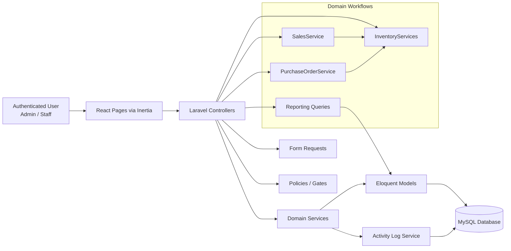

# Architecture Overview

This document explains the main building blocks of the application and how data moves through the system.

## System Diagram

## Layer Responsibilities

### Inertia + React Pages

- render operational screens for products, sales, procurement, reports, and logs
- keep navigation fast without splitting the stack into separate frontend/backend apps
- align visible actions with authorization rules

### Controllers

- orchestrate page requests and actions
- delegate validation to Form Requests
- delegate business logic to service classes
- return Inertia pages, CSV downloads, and PDF downloads

### Policies and Gates

- protect admin-only modules such as reports, products, procurement, and activity logs
- ensure restricted features are enforced server-side, not only hidden in UI

### Domain Services

- `InventoryServices` controls stock in, stock out, and guarded adjustment rules
- `SalesService` creates sales, sale items, and stock deduction in one transaction
- `PurchaseOrderService` creates purchase orders and handles partial/full receiving
- `ActivityLogService` records operational events for traceability

### Eloquent Models

- represent core business entities such as products, sales, customers, suppliers, and purchase orders
- provide relationships used for reporting, invoices, and dashboard summaries

## Key Data Flows

### Sales Flow

1. User submits sale form.
2. Request is validated and authorized.
3. `SalesService` creates sale and sale items.
4. `InventoryServices` deducts stock and writes stock movement records.
5. Activity log captures the transaction event.

### Procurement Flow

1. Admin creates purchase order.
2. `PurchaseOrderService` stores PO and line items.
3. During receiving, submitted quantities are validated.
4. `InventoryServices` increases stock only for received quantities.
5. PO status moves from `ordered` to `partial` or `received`.

### Reporting Flow

1. Admin opens report page with optional date filters.
2. Controller runs aggregated queries over sales, products, and procurement data.
3. Data is rendered in React charts/tables.
4. Same query scope can be exported as CSV or PDF.

## Why This Matters For Portfolio Review

- It shows separation of concerns beyond tutorial-style CRUD.
- It demonstrates workflow thinking across multiple modules.
- It highlights consistency between validation, authorization, transactional logic, UI, and exports.
